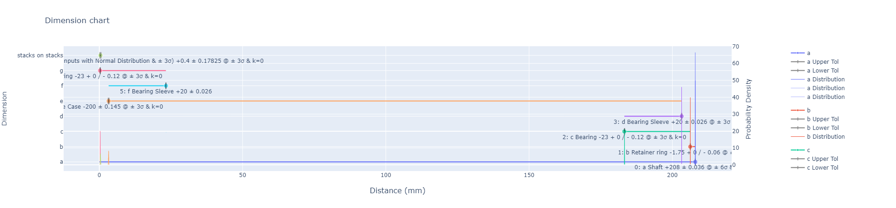
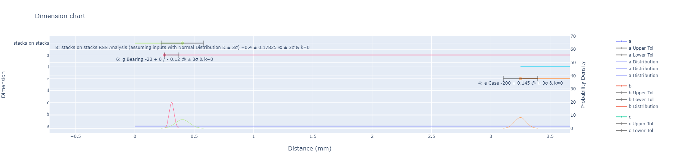

# dimstack

[](https://pdm.fming.dev)

Python library for mechanical engineers to help with statistical tolerancing analysis and design.

## Example

```python
import dimstack as ds

ds.display.mode("text")

m1 = ds.dim.Statistical(
    nom=208,
    tol=ds.tol.SymmetricBilateral(0.036),
    process_sigma=6,
    k=0.25,
    name="a",
    desc="Shaft",
)
m2 = ds.dim.Statistical(
    nom=-1.75,
    tol=ds.tol.UnequalBilateral(0, 0.06),
    process_sigma=3,
    name="b",
    desc="Retainer ring",
)
m3 = ds.dim.Statistical(nom=-23, tol=ds.tol.UnequalBilateral(0, 0.12), process_sigma=3, name="c", desc="Bearing")
m4 = ds.dim.Statistical(
    nom=20,
    tol=ds.tol.SymmetricBilateral(0.026),
    process_sigma=3,
    name="d",
    desc="Bearing Sleeve",
)
m5 = ds.dim.Statistical(nom=-200, tol=ds.tol.SymmetricBilateral(0.145), process_sigma=3, name="e", desc="Case")
m6 = ds.dim.Basic(
    nom=20,
    tol=ds.tol.SymmetricBilateral(0.026),
    # process_sigma=3,
    name="f",
    desc="Bearing Sleeve",
)
m7 = ds.dim.Statistical(nom=-23, tol=ds.tol.UnequalBilateral(0, 0.12), process_sigma=3, name="g", desc="Bearing")
items = [m1, m2, m3, m4, m5, m6, m7]

stack = ds.Stack(title="stacks on stacks", items=items)

stack.show()
stack.Closed.show()
stack.WC.show()
stack.RSS.show()
stack.MRSS.show()
stack.SixSigma(at=4.5).show()

spec = ds.Spec("stack spec", "", dim=stack.SixSigma(at=4.5), LL=0.05, UL=0.8)
spec.show()

ds.plot.StackPlot().add(stack).add(stack.RSS).show()
```

Returns:

```
Stack: stacks on stacks
ID Name    Description dir  Nom.           Tol. Sen.    Relative Bounds   Dist. Process Sigma    k C_p C_pk       μ       σ μ_eff   σ_eff Yield Probability Reject PPM
 0    a          Shaft   + 208.0 ± 0.036           1 [207.964, 208.036]  Normal          ± 6σ 0.25 2.0  1.5 208.009   0.006 208.0   0.008       99.99932047        6.8
 1    b  Retainer ring   -  1.75 + 0 / - 0.06      1       [1.69, 1.75]  Normal          ± 3σ    0 1.0  1.0    1.72    0.01  1.72    0.01       99.73002039     2699.8
 2    c        Bearing   -  23.0 + 0 / - 0.12      1        [22.88, 23]  Normal          ± 3σ    0 1.0  1.0   22.94    0.02 22.94    0.02       99.73002039     2699.8
 3    d Bearing Sleeve   +  20.0 ± 0.026           1   [19.974, 20.026]  Normal          ± 3σ    0 1.0  1.0    20.0 0.00867  20.0 0.00867       99.73002039     2699.8
 4    e           Case   - 200.0 ± 0.145           1 [199.855, 200.145]  Normal          ± 3σ    0 1.0  1.0   200.0 0.04833 200.0 0.04833       99.73002039     2699.8
 5    f Bearing Sleeve   +  20.0 ± 0.026           1   [19.974, 20.026] Uniform
 6    g        Bearing   -  23.0 + 0 / - 0.12      1        [22.88, 23]  Normal          ± 3σ    0 1.0  1.0   22.94    0.02 22.94    0.02       99.73002039     2699.8

Dimension: stacks on stacks - Closed Analysis
ID             Name     Description dir Nom.              Tol. Sen. Relative Bounds Distribution
 7 stacks on stacks Closed Analysis   + 0.25 + 0.533 / - 0.233    1  [0.017, 0.783]      Uniform

Dimension: stacks on stacks - WC Analysis
ID             Name Description dir Nom.           Tol. Sen. Relative Bounds Distribution
 8 stacks on stacks WC Analysis   +  0.4 ± 0.383           1  [0.017, 0.783]      Uniform

WARNING:root:Converting BasicDimension (5: f Bearing Sleeve +20 ± 0.026) to StatisticalDimension
Dimension: stacks on stacks - RSS Analysis (assuming inputs with Normal Distribution & ± 3σ)
ID             Name                                                    Description dir Nom.           Tol. Sen.    Relative Bounds Distribution Process Sigma k C_p C_pk   μ       σ μ_eff   σ_eff Yield Probability Reject PPM
10 stacks on stacks RSS Analysis (assuming inputs with Normal Distribution & ± 3σ)   +  0.4 ± 0.17825         1 [0.22175, 0.57825]       Normal          ± 3σ 0 1.0  1.0 0.4 0.05942   0.4 0.05942       99.73002039     2699.8

WARNING:root:Converting BasicDimension (5: f Bearing Sleeve +20 ± 0.026) to StatisticalDimension
Dimension: stacks on stacks - MRSS Analysis (assuming inputs with Normal Distribution & ± 3σ)
ID             Name                                                     Description dir Nom.           Tol. Sen.    Relative Bounds Distribution Process Sigma k     C_p    C_pk   μ       σ μ_eff   σ_eff Yield Probability Reject PPM
12 stacks on stacks MRSS Analysis (assuming inputs with Normal Distribution & ± 3σ)   +  0.4 ± 0.24046         1 [0.15954, 0.64046]       Normal    ± 3.76693σ 0 1.25564 1.25564 0.4 0.06383   0.4 0.06383       99.98347307     165.27

WARNING:root:Converting BasicDimension (5: f Bearing Sleeve +20 ± 0.026) to StatisticalDimension
Dimension: stacks on stacks - '6 Sigma' Analysis (assuming inputs with Normal Distribution)
ID             Name                                                   Description dir Nom.           Tol. Sen.    Relative Bounds Distribution Process Sigma k C_p C_pk   μ       σ μ_eff   σ_eff Yield Probability Reject PPM
14 stacks on stacks '6 Sigma' Analysis (assuming inputs with Normal Distribution)   +  0.4 ± 0.26433         1 [0.13567, 0.66433]       Normal        ± 4.5σ 0 1.5  1.5 0.4 0.05874   0.4 0.05874       99.99932047        6.8

WARNING:root:Converting BasicDimension (5: f Bearing Sleeve +20 ± 0.026) to StatisticalDimension
Spec: stack spec
      Name Description                                                                                                        Dimension Spec. Limits Median       k     C_p    C_pk Yield Probability Reject PPM
stack spec             16: stacks on stacks '6 Sigma' Analysis (assuming inputs with Normal Distribution) +0.4 ± 0.26433 @ ± 4.5σ & k=0  [0.05, 0.8]  0.425 0.06667 2.12804 1.98617               100          0

```




## Usage

dimstack can be used in a standard python script, or as a REPL, allowing use in JupyterLab.

Demo usage in a JupyterLite Lab

- https://phcreery.github.io/dimstack-demo/lab/index.html

Demo usage in a JuptyerLite REPL:

- https://phcreery.github.io/dimstack-demo/repl/index.html?kernel=python&toolbar=1&code=%pip%20install%20-q%20dimstack%0Aimport%20dimstack%20as%20ds

Embed in your site:

```html
<iframe
  src="https://phcreery.github.io/dimstack-demo/repl/index.html?kernel=python&toolbar=1&code=%pip%20install%20-q%20dimstack%0Aimport%20dimstack%20as%20ds"
  width="100%"
  height="100%"
></iframe>
```

## Dev

### Notebooks

In JupyterLite instances, you first have to pip install the wheel embedded.

```
%pip install -q dimstack
```

### Testing

```
python -m unittest discover .\tests\
```

# Acknowledgements

- http://www.newconceptzdesign.com/stackups/
- https://github.com/slightlynybbled/tol-stack
- https://www.mitcalc.com/doc/tolanalysis1d/help/en/tolanalysis1d.htm
